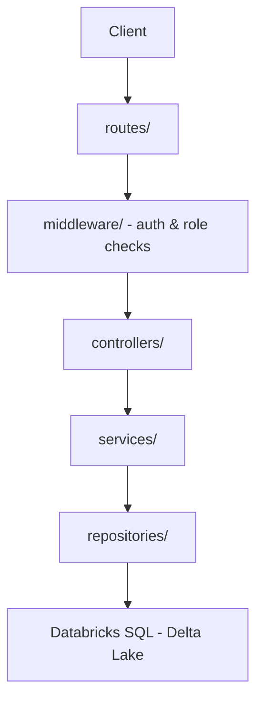

# wipfli-crud

A fullstack CRUD application demonstrating fundamental database and API design patterns. Built as an internship learning project to explore backend architecture, authentication, authorization, and order management workflows.

## Table of Contents

* [Project Overview](#project-overview)
* [Tech Stack](#tech-stack)
* [System Architecture](#system-architecture)
* [Data Model](#data-model)
* [API Endpoints](#api-endpoints)
* [Key Features](#key-features)
* [Setup Instructions](#setup-instructions)
* [Project Structure](#project-structure)
* [Key Implementation Highlights](#key-implementation-highlights)
* [Learnings & Future Improvements](#learnings--future-improvements)

## Project Overview

wipfli-crud is a fullstack CRUD application demonstrating fundamental database and API design patterns. Built during an internship learning exercise, it implements user authentication, role-based authorization, and order management workflows. The backend uses Node.js with Express for routing and business logic, Databricks SQL on Delta Lake for persistence, JWT tokens for stateless authentication, and bcrypt for password security. The system enforces role-based access control with CUSTOMER and ADMIN roles across all endpoints.

## Tech Stack

**Backend**
* Node.js + Express
* JWT (access + refresh tokens)
* bcrypt (password hashing)

**Database**
* Databricks SQL (Delta Lake)
* Catalog: `crud`
* Schema: `crud`

**Architecture Pattern**
* Layered architecture: Routes → Controllers → Services → Repositories
* Role-based access control (RBAC)
* Middleware-driven authentication and authorization

## System Architecture



**Request Flow**
1. Client sends HTTP request
2. Express routes receive and parse request
3. Middleware validates JWT and checks role permissions
4. Controllers handle request/response logic
5. Services implement business logic
6. Repositories execute database operations
7. Databricks SQL persists data in Delta Lake tables

## Data Model

| Table | Primary Key | Foreign Keys | Key Constraints | Purpose |
|-------|-------------|--------------|-----------------|---------||
| app_users | user_id | None | Email unique, role enum | Store user credentials and roles |
| products | product_id | None | Name unique, price positive | Manage product catalog |
| orders | order_id | user_id → app_users | Status enum, timestamps | Track order lifecycle |
| order_items | order_item_id | order_id → orders, product_id → products | Quantity positive | Link products to orders |
| refresh_tokens | token_id | user_id → app_users | Token unique, expiry required | Manage JWT refresh tokens |

**Role Enum**: `CUSTOMER`, `ADMIN`

**Order Status Enum**: `PENDING`, `CONFIRMED`, `COMPLETED`, `CANCELLED`

## API Endpoints

### Authentication

| Method | Endpoint | Auth | Role | Description |
|--------|----------|------|------|-------------|
| POST | `/auth/register` | ✗ | ANY | Create new user account |
| POST | `/auth/login` | ✗ | ANY | Authenticate and issue tokens |
| POST | `/auth/refresh` | ✗ | ANY | Exchange refresh token for new access token |
| POST | `/auth/logout` | ✓ | ANY | Invalidate refresh token |

### Products

| Method | Endpoint | Auth | Role | Description |
|--------|----------|------|------|-------------|
| GET | `/products` | ✗ | ANY | List all available products |
| GET | `/products/:id` | ✗ | ANY | Retrieve single product details |
| POST | `/products` | ✓ | ADMIN | Create new product |
| PUT | `/products/:id` | ✓ | ADMIN | Update existing product |
| DELETE | `/products/:id` | ✓ | ADMIN | Remove product from catalog |

### Orders

| Method | Endpoint | Auth | Role | Description |
|--------|----------|------|------|-------------|
| POST | `/orders` | ✓ | CUSTOMER | Place new order with items |
| GET | `/orders` | ✓ | ADMIN | View all orders across users |
| GET | `/orders/:id` | ✓ | CUSTOMER | View own order details |
| PATCH | `/orders/:id/confirm` | ✓ | ADMIN | Transition order to CONFIRMED |
| PATCH | `/orders/:id/complete` | ✓ | ADMIN | Transition order to COMPLETED |
| PATCH | `/orders/:id/cancel` | ✓ | CUSTOMER | Cancel own PENDING order |

## Key Features

### Authentication & Authorization
* JWT-based stateless authentication
* Access tokens (short-lived) + refresh tokens (long-lived)
* bcrypt password hashing with salt
* Role-based middleware enforcement

### Order Management
* Full order lifecycle: PENDING → CONFIRMED → COMPLETED
* Customer cancellation (PENDING orders only)
* Owner-only access enforcement
* Multi-item order support

### Product Catalog
* Admin-only CRUD operations
* Public read access
* Unique product names

### Security
* Password hashing (never store plaintext)
* Token-based authentication
* Role-based access control
* Owner verification on resource access

## Setup Instructions

### Prerequisites
* Node.js (v14+)
* Databricks workspace access
* Databricks SQL warehouse or cluster

### Database Setup

1. **Open the database setup notebook** in your Databricks workspace:
   ```
   /Users/your-email/wipfli-crud/database/database_setup_runner.ipynb
   ```

2. **Run all cells** in order. The notebook will:
   * Create catalog `crud` and schema `crud`
   * Execute DDL files to create all 5 tables
   * Seed tables with initial data
   * Run validation, join, analytics, and inventory queries

3. **Verify** the setup by checking the final query outputs

### Backend Setup

1. **Clone the repository**
   ```bash
   git clone <repository-url>
   cd wipfli-crud
   ```

2. **Install dependencies**
   ```bash
   npm install
   ```

3. **Configure environment variables**
   
   Create a `.env` file:
   ```env
   # Database
   DATABRICKS_HOST=<your-workspace-url>
   DATABRICKS_TOKEN=<your-access-token>
   DATABRICKS_CATALOG=crud
   DATABRICKS_SCHEMA=crud
   
   # JWT
   JWT_SECRET=<your-secret-key>
   JWT_REFRESH_SECRET=<your-refresh-secret>
   ACCESS_TOKEN_EXPIRY=15m
   REFRESH_TOKEN_EXPIRY=7d
   
   # Server
   PORT=3000
   ```

4. **Start the server**
   ```bash
   npm start
   ```

5. **Test the API**
   ```bash
   curl http://localhost:3000/products
   ```

## Project Structure

```
wipfli-crud/
├── routes/              # Express route definitions
│   ├── auth.js
│   ├── products.js
│   └── orders.js
├── middleware/          # Authentication and role checks
│   ├── auth.js
│   └── roles.js
├── controllers/         # Request/response handling
│   ├── authController.js
│   ├── productController.js
│   └── orderController.js
├── services/            # Business logic
│   ├── authService.js
│   ├── productService.js
│   └── orderService.js
├── repositories/        # Database operations
│   ├── userRepository.js
│   ├── productRepository.js
│   ├── orderRepository.js
│   └── tokenRepository.js
├── database/            # Database setup files
│   ├── database_setup_runner.ipynb
│   ├── ddl/            # Table creation scripts
│   ├── seed/           # Initial data
│   └── queries/        # Validation and analytics
├── config/              # Configuration files
└── server.js            # Application entry point
```

## Key Implementation Highlights

### JWT Refresh Token Flow
Access tokens expire quickly for security; refresh tokens stored in the database enable seamless re-authentication without requiring login credentials again. When an access token expires, clients present their refresh token to receive a new access token without logging in.

### Order Lifecycle State Machine
Orders progress through PENDING → CONFIRMED → COMPLETED with role-specific transitions, or can be cancelled by customers before confirmation, preventing invalid state changes. Admins control order progression while customers retain cancellation rights for pending orders.

### Role-Based Access Control
Middleware intercepts requests to verify both authentication and role requirements, ensuring customers cannot access admin endpoints and users can only view their own orders. Role checks occur after authentication but before controller logic executes.

### Password Hashing with bcrypt
Plain passwords are never stored; bcrypt generates salted hashes that are computationally expensive to reverse, protecting credentials even if the database is compromised. Each password receives a unique salt, preventing rainbow table attacks.

## Learnings & Future Improvements

### What This Project Taught Me
* **Layered architecture**: Separating routing, business logic, and data access improves maintainability and testability. Each layer has a single responsibility and can be modified independently.
* **JWT authentication**: Understanding how token-based auth works in production systems, including access/refresh token patterns and secure storage strategies.
* **Role-based authorization**: Why RBAC matters for data security and how middleware enforcement prevents unauthorized access at the routing layer.

### Future Improvements

1. **Parameterized Queries**
   * **Current Issue**: String concatenation for SQL queries is vulnerable to injection attacks
   * **Solution**: Implement prepared statements for all database operations
   * **Impact**: Critical security improvement

2. **Database Transactions**
   * **Current Issue**: Order placement lacks transactional integrity—if inserting order_items fails after creating an order, partial data remains
   * **Solution**: Wrap multi-table operations in database transactions to ensure atomic commits
   * **Impact**: Maintains data consistency during complex operations

3. **Frontend Development**
   * **Current Gap**: No user interface; API tested via curl/Postman
   * **Solution**: Build a React frontend with order management dashboard
   * **Impact**: Complete fullstack application with real user workflows

4. **API Documentation**
   * **Current Gap**: No automated API documentation
   * **Solution**: Integrate Swagger/OpenAPI for interactive API docs
   * **Impact**: Better developer experience and easier testing

5. **Testing**
   * **Current Gap**: No automated test coverage
   * **Solution**: Add unit tests (Jest) and integration tests (Supertest)
   * **Impact**: Confidence in code changes and regression prevention

6. **Error Handling**
   * **Current Gap**: Basic error responses without standardized format
   * **Solution**: Implement centralized error handling middleware with consistent error codes
   * **Impact**: Better API consumer experience

## License

This project is for educational purposes.

## Acknowledgments

Built during an internship at Wipfli as a learning exercise in fullstack development and database management.